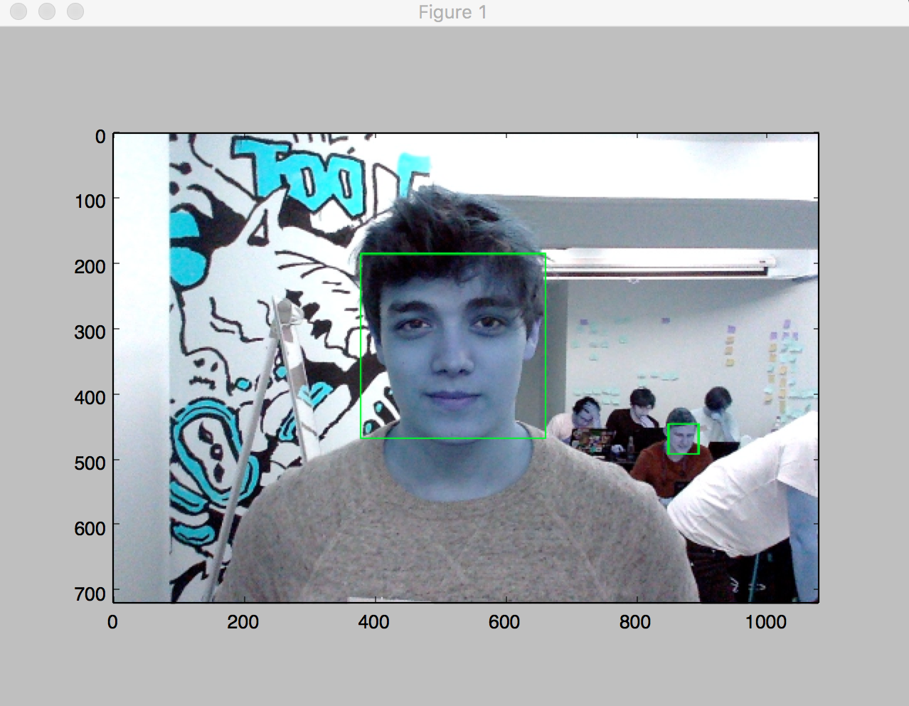
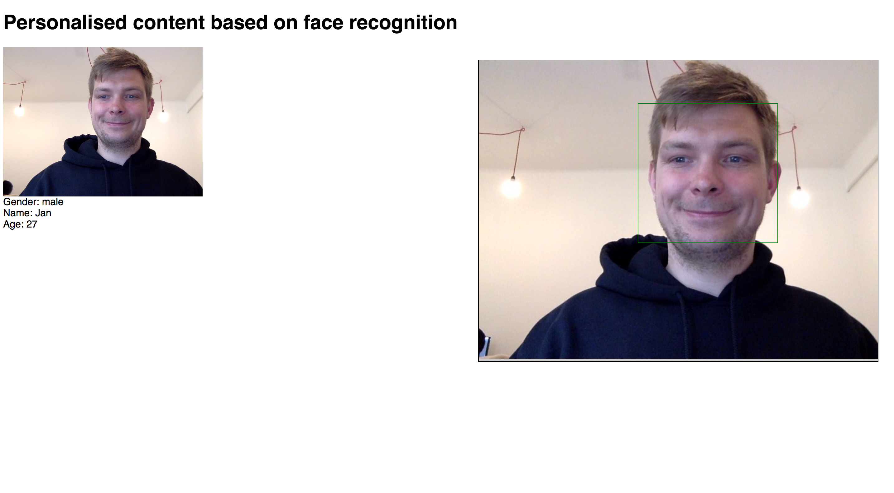

# Hackprague face-recognition
Face recognition app for marketing built during the [HackPrague hackathon](https://devpost.com/software/hackprague-face-recognition).

## Face detection
Implementation of the face detector is in the folder `face_detector`.
It works based on the [Viola Jones object detection framework](https://en.wikipedia.org/wiki/Viola%E2%80%93Jones_object_detection_framework) 

### Example visualization

## Face recognizer
Implementation of the face detector is available in the `face_classifier` folder.
Model is based on the pretarined [VGG-16](http://www.robots.ox.ac.uk/~vgg/research/very_deep/) neral network that is being fine-tuned for the desired faces.

## Http Server
Using easy Flask server.

## Frontend
Implementation of the frontend is in the folder `webcam` and it's implemented in HTML and JavaScript.

### Example frontend screenshot

